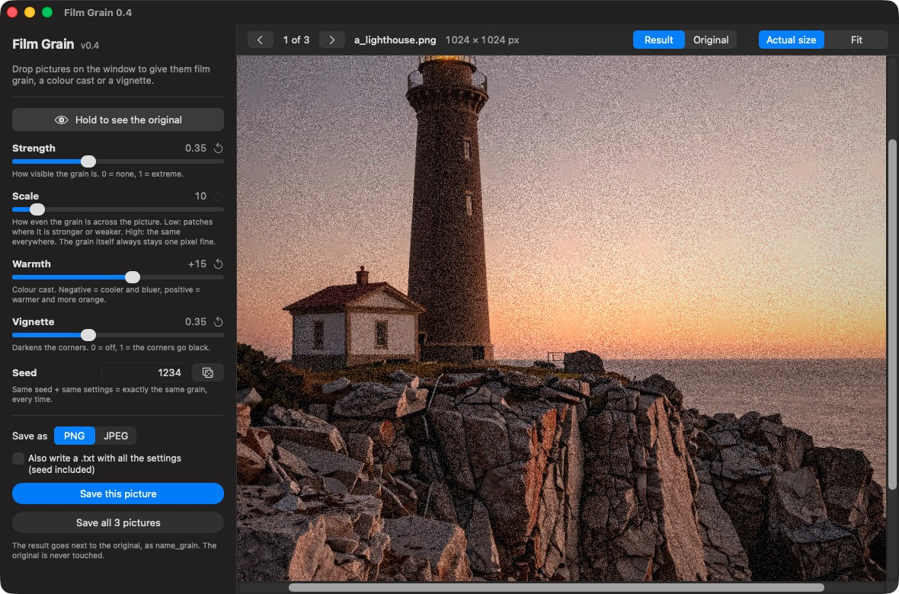

# Film Grain — drop a picture, get film grain, on your Mac

**A small native Mac app that adds film grain, a colour cast and a vignette to your pictures. Drop them on the window, adjust, save.**

No browser, no Python, nothing to install. Strength, scale, warmth and
vignette are on one page, each with a plain sentence beside it saying what it
actually does. Nothing leaves your Mac.



*Live preview at actual size, so you judge the grain where it really is.*

> This is an **unofficial** tool. The effect is a Swift re-implementation of
> the **FilmGrain node** of
> [ComfyUI-post-processing-nodes](https://github.com/EllangoK/ComfyUI-post-processing-nodes)
> by **EllangoK** ([the original file](https://github.com/EllangoK/ComfyUI-post-processing-nodes/blob/master/post_processing/film_grain.py)).
> It is not made by or affiliated with them. Because it derives from that
> node, it is released under the same licence, **GPL-3.0** — see
> [Licence and attribution](#-licence-and-attribution).

**[⬇️ Download the app →](https://github.com/Quick-Eyed-Sky/film-grain-mac/releases/latest)**
· **[Why macOS asks you to confirm before opening it →](docs/macos-security.md)**
· [Ce README en français →](README.fr.md)

---

## ✨ What it does

- **Drop one picture, several, or a whole folder** on the window — or on the
  app's icon in the Dock. Pictures dropped again later replace the previous
  ones; files already ending in `_grain` are skipped, so a folder is safe to
  drop twice.
- **Live preview, and a button to compare.** Press and hold **Hold to see the
  original**, at the top of the controls, to see the picture without any
  effect; let go and the effects come back. Your eyes can compare with and
  without, without touching a slider. (The *Result / Original* switch above
  the picture does the same, but stays where you put it.)
- **Fast.** The grain pattern is computed once; moving *Strength*, *Warmth*
  or *Vignette* does not recompute it, so the preview follows instantly. For a
  12-megapixel picture the grain takes about 20 ms (measured), and the whole
  round trip — read the file, add the grain, write it back with its metadata —
  about 0.7 s.
- **Browse with the left and right arrow keys**, looping: after the last
  picture comes the first.
- **Spot-check a big batch with the comma key.** Press `,` (it is listed in the
  **Pictures** menu, as *Random Picture*) to jump to a picture picked at random
  from your list. Each one comes up once before any comes back, so with 200
  pictures you can see "here and there" whether the effect is right before you
  save anything.
- **Saves next to the original** as `name_grain.png` (or `.jpg`, quality 95).
  The original is never touched, and nothing is ever overwritten — a taken
  name becomes `name_grain_2.png`.
- **Keeps what is in the file**: colour profile and metadata (EXIF and XMP).
  For a picture made with Draw Things, the prompt and generation settings stay
  in the saved file.
- **A seed**, so the same seed and the same settings give exactly the same
  grain. Optionally, a small `.txt` next to each result records every setting
  (off by default).
- **Remembers your last settings**, including the view (*Fit* or *Actual size*).

## ⚠️ Worth knowing before you start

**"Scale" does not make the grain bigger.** That is surprising, and it was
checked against the original node's code: the grain is always **one pixel**. What
*Scale* controls is how **evenly** the grain is spread over the picture — low
values give patches where it is stronger or weaker, high values give the same
grain everywhere. If you want coarse grain (the look of a fast film), this
node does not do that, and neither does this app.

**Judge the grain at *Actual size*.** *Fit* shrinks the picture to fit the
window, and a shrunken picture averages the grain away. A *Strength* change can
look like it does almost nothing in *Fit*, and a lot in *Actual size*.

---

## 💻 Requirements

- A Mac with **Apple Silicon** (M1 or later) — the app is built for it only.
- **macOS 14 (Sonoma) or later** — that is what the app is built for. It has
  only been run and tested on macOS 26, so 14 and 15 are the declared target,
  not a tested fact.

## 📥 Get it — two ways

**1. Download the app** from the
**[Releases page](https://github.com/Quick-Eyed-Sky/film-grain-mac/releases/latest)**: unzip, drag `Film Grain.app` to
your Applications folder. **macOS will ask you to confirm before it opens it the
first time** — that is normal for an app that is not signed with an Apple
Developer ID, it says nothing about what the app does, and
**[this page explains exactly why and how to open it](docs/macos-security.md)**.

**2. Build it yourself, from the source in this repository** — and macOS
will not ask anything, because an app you build on your own Mac was never
"downloaded". You need Apple's command line tools (not the full Xcode):

```
xcode-select --install
```

then, in Terminal:

```
git clone https://github.com/Quick-Eyed-Sky/film-grain-mac.git
cd film-grain-mac/source
./build_app.sh
```

It takes a few seconds and puts `Film Grain.app` in the `film-grain-mac`
folder. Nothing else is installed or changed on your Mac.

---

## 🎛️ The controls

The defaults are the ones of the original node.

| Control | What it does |
|---|---|
| **Strength** (0–1, default 0.20) | How visible the grain is. 0 = none. |
| **Scale** (1–100, default 10) | How *even* the grain is across the picture — **not its size** (see above). |
| **Warmth** (−100 to +100, default 0) | Colour cast. Negative = cooler and bluer, positive = warmer and more orange. |
| **Vignette** (0–1, default 0) | Darkens the corners. 1 = the corners go black. |
| **Seed** | Same seed + same settings = exactly the same grain. The dice button picks another. |

## 🔬 How it differs from the original node

- **A seed.** The node draws a different grain on every run, with no way to
  get one back. Here the seed is part of the settings.
- **Vignette stops at 1.** The node offers up to 10, but anything above 1 does
  nothing more, so the slider stops where the effect does.
- **Speed.** The grain pattern is cached, as described above.

It is the same maths otherwise: the statistics of the node's grain (its own
Python code, run on a real picture) were compared with this app's, for three
values of *Scale* — strength of the grain, and how much it varies across the
picture — and they match.

## 🧾 Limits

- A picture with **transparency** is flattened onto white (a note says so in
  the `.txt`, if you ask for one).
- A **16-bit** picture is brought down to 8 bits per channel.
- **Grain does not compress.** A grained PNG is a lot bigger than the
  original: between 37 % and 174 % bigger in the tests (a smoothly upscaled
  picture grows the most).
- No signed or notarised build, hence the confirmation macOS asks for — see
  [the explanation](docs/macos-security.md).

---

## 📜 Licence and attribution

**This app is GPL-3.0** — see [LICENSE](LICENSE) and [NOTICE.md](NOTICE.md).

It is a **derived work**: the grain, the warmth and the vignette are a Swift
re-implementation of the `FilmGrain` node of
[ComfyUI-post-processing-nodes](https://github.com/EllangoK/ComfyUI-post-processing-nodes)
by **EllangoK**, which is itself GPL-3.0. **This is a modified adaptation, not
the original:** rewritten in Swift as a standalone Mac app, with a seed, a
cache of the grain pattern, a vignette range limited to what has an effect, and
a window around it. If you redistribute it, GPL-3.0 applies to you too: keep
the licence, keep this credit, say that you changed it, and make the source
available.

It uses nothing outside macOS itself (SwiftUI, Core Graphics, Image I/O), so
there is no third-party code to credit besides the node.

---

## 👋 Who made this

Jean-Pascal — **[Quick-Eyed Sky](https://www.youtube.com/@QuickEyedSky)** on
YouTube, [QES](https://huggingface.co/QES) on Hugging Face. Not a
programmer: this exists because I wanted that node's grain as a small Mac app
of its own.

If it saved you an afternoon, you can
[buy me a coffee](https://buymeacoffee.com/oFJ5CiY7n). Entirely optional,
and the project stays exactly as free either way.

---

## 🙏 Thanks

To **EllangoK**, for the
[ComfyUI-post-processing-nodes](https://github.com/EllangoK/ComfyUI-post-processing-nodes)
this is built on, and for publishing it under a licence that lets others learn
from it.
